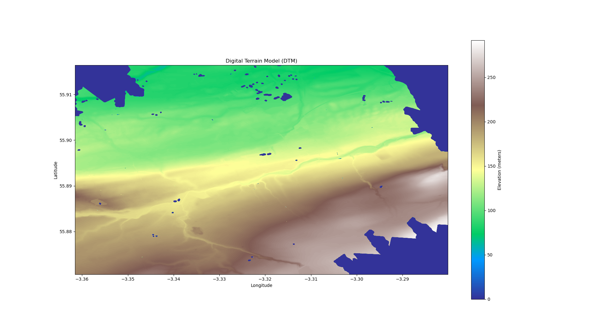
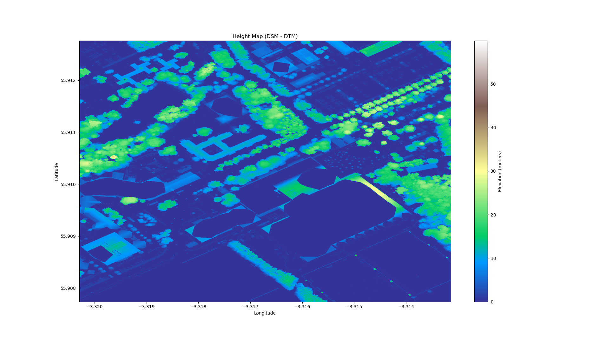
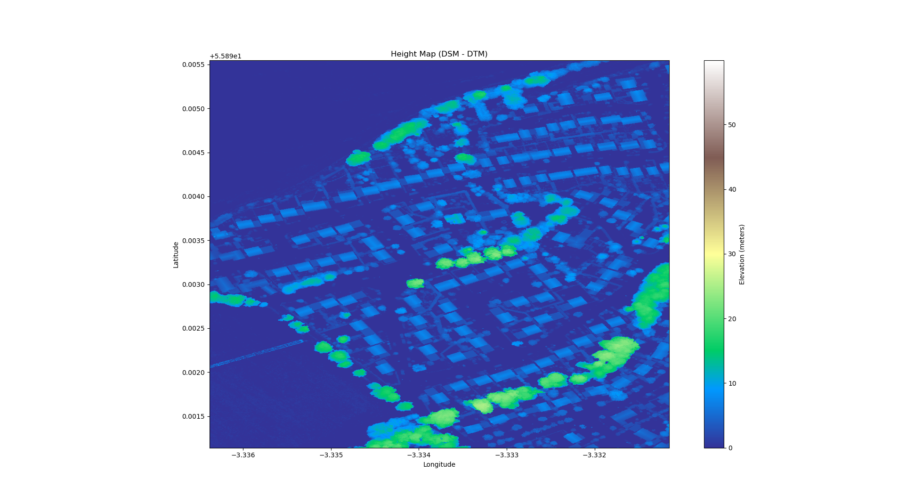

# LiDAR Demo
This is my sample code for working DSM, and DTM data as well as visualize the data. I have not checked out LAS file. There are some packages/libraries that we need to install such as `rasterio` and `pyproj`. Please refer to `Installation.md` for additional information.

## Database
I use DSM and DTM data from [Scottish Remote Sensing database](https://remotesensingdata.gov.scot/).
I put bash file for downloading sample data. `NT27SE` is a smaller map with ~50MB, I used for checking for bug. `NT16NE` is a bigger file ~350MB, I used this chunk for visualize. All the pictures below are obtained from `NT16NE`.

## DSM, DTM, Height map

There are some missing elevation point in DTM map.

Basic shape of house

