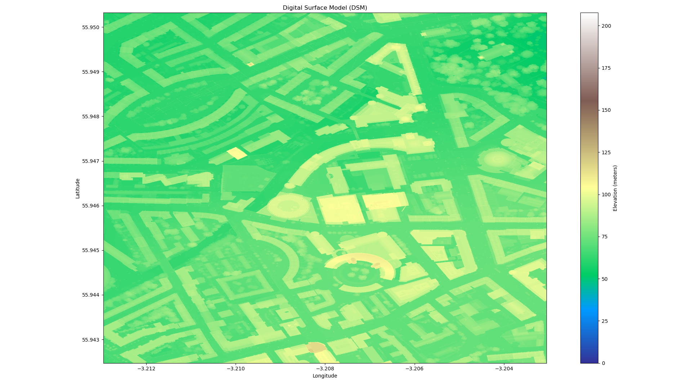

# LiDAR Demo
This is my sample code for working DSM, and DTM data as well as visualize the data. I have not checked out LAS file. There are some packages/libraries that we need to install such as `rasterio` and `pyproj`. Please refer to `Installation.md` for additional information.

## Database
I use DSM and DTM data from [Scottish Remote Sensing database](https://remotesensingdata.gov.scot/).
I put bash file for downloading sample data. `NT27SE` is a smaller map with ~50MB, I used for checking for bug. `NT16NE` is a bigger file ~350MB, I used this chunk for visualize. All the pictures below are obtained from `NT16NE`.

## Performance issue
The coordinate system used in the dataset is not in latitude and longitude. A coordinate transformation is required using `pyproj` package but this process is a bottleneck in this code.

## Datamap with no missing data
If you choose dataset from `phase 5`, there is no missing data. Here is some example from Edinburgh.

Zoom in

## DSM, DTM, Height map
the area is pretty suburban and there is no tall building in the map. Most trees are taller than house in the map.

There are some missing elevation point in DTM map.

Basic shape of house

